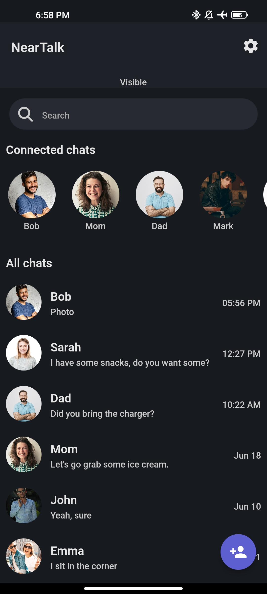
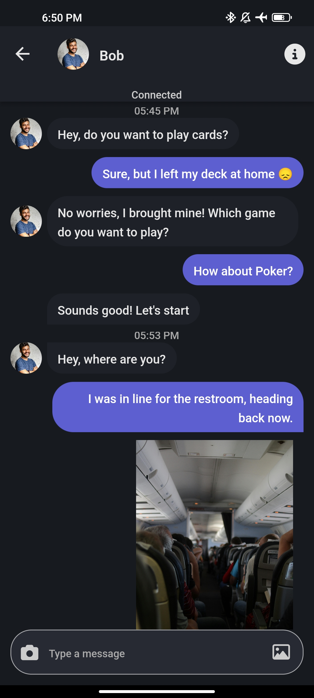
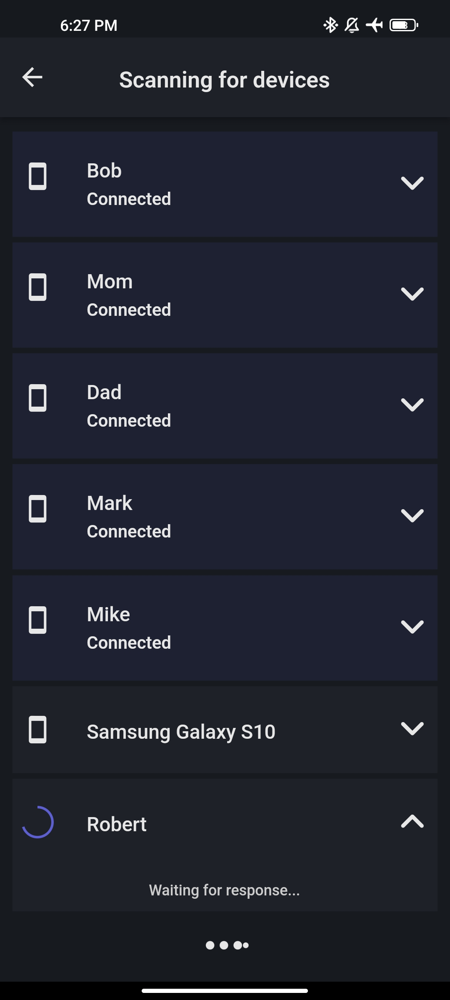
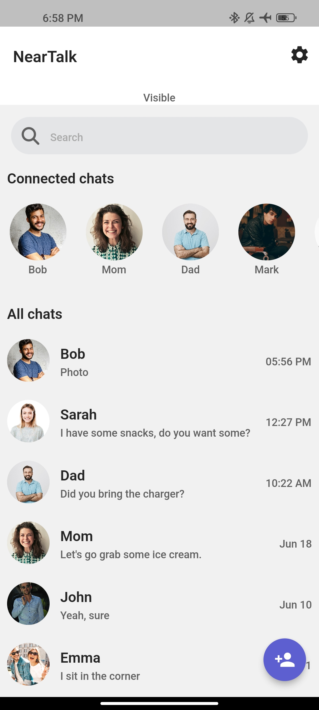
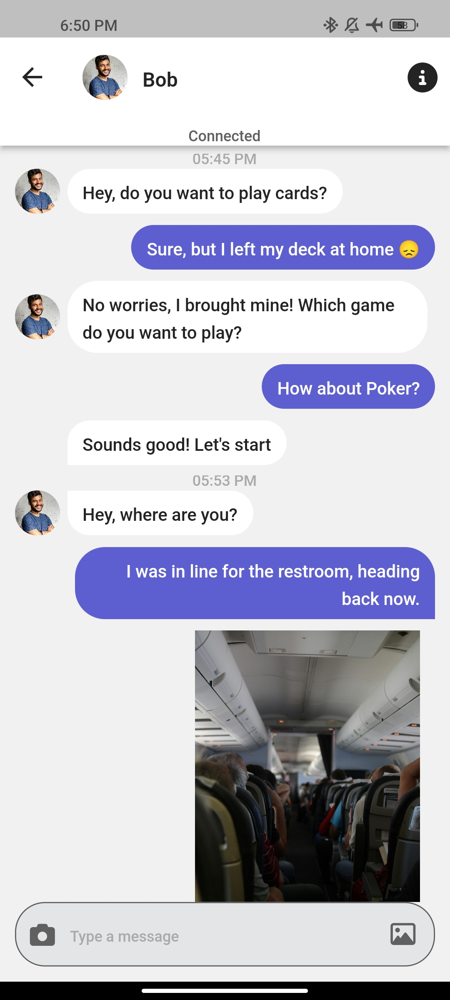
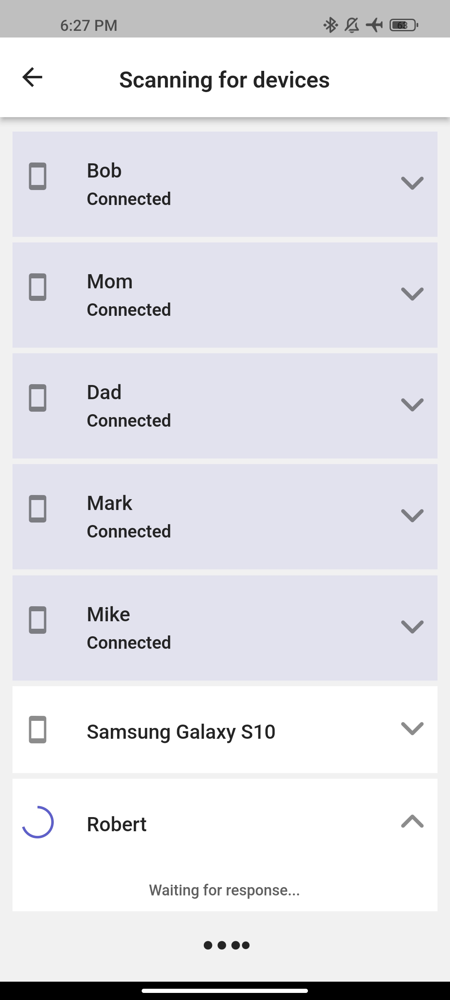

# NearTalk 📱💬

NearTalk is a simple, peer-to-peer chat application built using Flutter. It leverages the Nearby Connections API to enable communication between devices without requiring an internet connection or cellular signal. This makes it ideal for situations where traditional connectivity is unavailable, such as during a flight or in remote locations.

## Features 🌟

- **Peer-to-Peer Chat**: Communicate directly between devices using Nearby Connections API.
- **Send Images**: Share images from your gallery or capture photos directly within the app.
- **Local Storage**: All chat messages are stored locally on your device.
- **Notifications**: Receive notifications for new messages.
- **Offline Usage**: Ideal for use in situations without signal and internet.

## Use Cases ✈️🏞️🚨

- **In-Flight Communication**: Chat with friends or family members on the same flight, even if you are not seated next to each other.
- **Remote Locations**: Stay in touch in places without internet or cellular connectivity.
- **Emergency Situations**: Use NearTalk to communicate in emergency situations where traditional networks are down.

## Screenshots 📸

## Contributing 🤝

Contributions are welcome! If you have suggestions, bug reports, or feature requests, please open an issue or submit a pull request.

Thank you for choosing NearTalk! Stay connected anytime, anywhere. 😊

